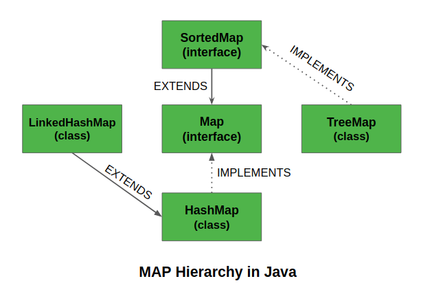

# Map in Java
A Map is an object that maps keys to values. A map cannot contain duplicate keys: Each key can map to at most one value. It models the mathematical function abstraction.
## Map Interface in Java
* package: **java.util.Map**
* Methods for basic operations (such as **put, get, remove, containsKey, containsValue, size, and empty**)
* Methods for Bulk operations (such as **putAll and clear**)
* Methods for collection views (such as **keySet, entrySet, and values**)
* The Java platform contains three general-purpose Map implementations: **HashMap, TreeMap, and LinkedHashMap**. 
* Some implementations allow null key and null value like the **HashMap** and **LinkedHashMap**, but some do not like the **TreeMap**.
* The order of a map depends on specific implementations, e.g **TreeMap** and **LinkedHashMap** have predictable order, while **HashMap** does not.
* There are two interfaces for implementing Map in java: **Map** and **SortedMap**, and three classes: **HashMap, TreeMap and LinkedHashMap**.

```
public interface Map<K,V>
```



## Why and When to use Maps?
Maps are perfect to use for key-value association mapping such as dictionaries. The maps are used to perform lookups by keys or when someone wants to retrieve and update elements by keys. Some examples are:

* A map of error codes and their descriptions.
* A map of zip codes and cities.

## Useful Methods in Map Interface
* public Object **put**(Object key, Object value): This method is used to insert an entry in this map.
* public void **putAll**(Map map): This method is used to insert the specified map in this map.
* public Object **remove**(Object key): This method is used to delete an entry for the specified key.
* public Object **get**(Object key):This method is used to return the value for the specified key.
* public boolean **containsKey**(Object key): This method is used to search the specified key from this map.
* public Set **keySet**(): This method is used to return the Set view containing all the keys.
* public Set **entrySet**(): This method is used to return the Set view containing all the keys and values.

## SortedMap Interface in Java
SortedMap is an interface in collection framework. This interface extends Map inrerface and provides a total ordering of its elements (elements can be traversed in sorted order of keys).
The main characteristic of a SortedMap is that, it orders the keys by their natural ordering, or by a specified comparator. So consider using a TreeMap when you want a map that satisfies the following criteria:

* null key or null value are not permitted.
* The keys are sorted either by natural ordering or by a specified comparator.

### Useful Methods of SortedMap

* **subMap**(K fromKey, K toKey): Returns a view of the portion of this Map whose keys range from fromKey, inclusive, to toKey, exclusive.
* **headMap**(K toKey): Returns a view of the portion of this Map whose keys are strictly less than toKey.
* **tailMap**(K fromKey): Returns a view of the portion of this Map whose keys are greater than or equal to fromKey.
* **firstKey**(): Returns the first (lowest) key currently in this Map.
* **lastKey**(): Returns the last (highest) key currently in this Map.
* **comparator**(): Returns the Comparator used to order the keys in this Map, or null if this Map uses the natural ordering of its keys.
* **values**(): Returns a Collection view of the values contained in this map.
* **keySet**(): Returns a Set view of the keys contained in this map.
* **entrySet**(): Returns a Set view of the mappings contained in this map.

```
public interface SortedMap extends Map
{
    Comparator comparator();
    SortedMap subMap(K fromKey, K toKey);
    SortedMap headMap(K toKey);
    SortedMap tailMap(K fromKey);
    K firstKey();
    K lastKey();
}

// Java code to demonstrate SortedMap 
import java.util.Iterator; 
import java.util.Map; 
import java.util.Set; 
import java.util.SortedMap; 
import java.util.TreeMap; 

public class SortedMapExample 
{ 
	public static void main(String[] args) 
	{ 
		SortedMap<Integer, String> sm = 
					new TreeMap<Integer, String>(); 
		sm.put(new Integer(2), "practice"); 
		sm.put(new Integer(3), "quiz"); 
		sm.put(new Integer(5), "code"); 
		sm.put(new Integer(4), "contribute"); 
		sm.put(new Integer(1), "geeksforgeeks"); 
		Set s = sm.entrySet(); 

		// Using iterator in SortedMap 
		Iterator i = s.iterator(); 

		// Traversing map. Note that the traversal 
		// produced sorted (by keys) output . 
		while (i.hasNext()) 
		{ 
			Map.Entry m = (Map.Entry)i.next(); 

			int key = (Integer)m.getKey(); 
			String value = (String)m.getValue(); 

			System.out.println("Key : " + key + 
							" value : " + value); 
		} 
	} 
} 

//Output
Key : 1  value : geeksforgeeks
Key : 2  value : practice
Key : 3  value : quiz
Key : 4  value : contribute
Key : 5  value : code
```
## Examples of collecting to Maps using JDK 8 aggregate operations

```
// Group employees by department
Map<Department, List<Employee>> byDept = employees.stream()
.collect(Collectors.groupingBy(Employee::getDepartment));
Or compute the sum of all salaries by department:

// Compute sum of salaries by department
Map<Department, Integer> totalByDept = employees.stream()
.collect(Collectors.groupingBy(Employee::getDepartment,
Collectors.summingInt(Employee::getSalary)));
Or perhaps group students by passing or failing grades:

// Partition students into passing and failing
Map<Boolean, List<Student>> passingFailing = students.stream()
.collect(Collectors.partitioningBy(s -> s.getGrade()>= PASS_THRESHOLD)); 
You could also group people by city:

// Classify Person objects by city
Map<String, List<Person>> peopleByCity
         = personStream.collect(Collectors.groupingBy(Person::getCity));
Or even cascade two collectors to classify people by state and city:

// Cascade Collectors 
Map<String, Map<String, List<Person>>> peopleByStateAndCity
  = personStream.collect(Collectors.groupingBy(Person::getState,
  Collectors.groupingBy(Person::getCity)))
```

## Map interface basic operation examples
* The basic operations of Map (**put, get, containsKey, containsValue, size, and isEmpty**)
* Word frequency in a given string: frequency table ordering: random, alphabetical, words first appears in the string 

## Map interface bulk operation examplse
* Bulk operations of map **clear, putAll**
* merge two map into new one

## Collection views
The Collection views provide the only means to iterate over a Map. The Collection view methods allow a Map to be viewed as a Collection in these three ways:
* keySet — the Set of keys contained in the Map.
* values — The Collection of values contained in the Map. This Collection is not a Set, because multiple keys can map to the same value.
* entrySet — the Set of key-value pairs contained in the Map. The Map interface provides a small nested interface called Map.Entry, the type of the elements in this Set.

The Collection views support element removal in all its many forms — remove, removeAll, retainAll, and clear operations, as well as the Iterator.remove operation. (Yet again, this assumes that the backing Map supports element removal.)

The Collection views do not support element addition under any circumstances. It would make no sense for the keySet and values views, and it's unnecessary for the entrySet view, because the backing Map's put and putAll methods provide the same functionality.

## Fancy Uses of Collection Views: Map Algebra
* if one map contains all the key values of a second map: 
(**All the idioms presented thus far have been nondestructive**)
```
one.entrySet().containsAll(second);
```

* if tow map contains mappings for all of the same key
```
one.keySet().containsAll(second.keySet())
```
* Suppose you have a Map that represents a collection of attribute-value pairs, and two Sets representing required attributes and permissible attributes. (The permissible attributes include the required attributes.) The following snippet determines whether the attribute map conforms to these constraints and prints a detailed error message if it doesn't.

```
Map<K, V> attrMap = ...;
Set<K> requiredAttrs = ...;
Set<K>permittedAttrs = ...;
boolean valid = true;

Set<K> keys = attrMap.keySet();
// if map have all the required fields
attrMap.keySet().containsAll(requiredAttrs)

// if map have all the required fields
if (!keys.containsAll(requiredAttrs)) {
	Set<K> missing = new HashSet<K>(requiredAttrs);
	missing.removeAll(keys);
	System.out.println("Missing required keys: " + missing);
	valid = false;
}

if(!permittedAttrs.containsAll(keys)) {
	Set<K> invalid = new HashSet<K>(keys);
	invalid.removeAll(keys);
	System.out.pringln("Invalid Keys: " + invalid);
	valid = false;
}

// common keys
Set<K> common = new HashSet(m1);
common.retainAll(m2.keySet());
```

(**destructive**)
```
// remove all of the key-value pairs that one Map has in common with another
m1.entrySet().removeAll(m2.entrySet());

// Suppose you want to remove from one Map all of the keys that have mappings in another
m1.keySet().removeAll(m2.keySet())

```

**What happens when you start mixing keys and values in the same bulk operation? **

Suppose you have a Map, managers. that maps each employee in a company to the employee's manager. We'll be deliberately vague about the types of the key and the value objects. It doesn't matter, as long as they're the same. Now suppose you want to know who all the "individual contributors" (or nonmanagers) are. The following snippet tells you exactly what you want to know.

```
Map<Employee, Employee> managers = ...; //employee to manager map

//individual contributors?
Set<Employee> individualsContributors = new HashMap<Employee>(managers.keySet());
individualContributors.removeAll(managers.values());

// Suppose you want to fire all the employees who report directly to some manager, Simon
Employee simon = ...;
managers.values.removeAll(Collections.singleton(simon));

// get the employes who does not have a manager
Map<Employee, Employee> m = new HashMap<Employee, Employee>(managers);
m.values().removeAll(managers.keySet());
Set<Employee> slackers = m.keySet();
```
This example is a bit tricky. First, it makes a temporary copy of the Map, and it removes from the temporary copy all entries whose (manager) value is a key in the original Map. Remember that the original Map has an entry for each employee. Thus, the remaining entries in the temporary Map comprise all the entries from the original Map whose (manager) values are no longer employees. The keys in the temporary copy, then, represent precisely the employees that we're looking for.

## Multimaps
A multimap is like a Map but it can map each key to multiple values. The Java Collections Framework doesn't include an interface for multimaps because they aren't used all that commonly. It's a fairly simple matter to use a Map whose values are List instances as a multimap. This technique is demonstrated in the next code example, which reads a word list containing one word per line (all lowercase) and prints out all the anagram groups that meet a size criterion. An anagram group is a bunch of words, all of which contain exactly the same letters but in a different order. The program takes two arguments on the command line: (1) the name of the dictionary file and (2) the minimum size of anagram group to print out. Anagram groups containing fewer words than the specified minimum are not printed.

There is a standard trick for finding anagram groups: For each word in the dictionary, alphabetize the letters in the word (that is, reorder the word's letters into alphabetical order) and put an entry into a multimap, mapping the alphabetized word to the original word. For example, the word bad causes an entry mapping abd into bad to be put into the multimap. A moment's reflection will show that all the words to which any given key maps form an anagram group. It's a simple matter to iterate over the keys in the multimap, printing out each anagram group that meets the size constraint.

The following program is a straightforward implementation of this technique.

```
import java.util.*;
import java.io.*;

public class Anagrams {
    public static void main(String[] args) {
        int minGroupSize = Integer.parseInt(args[1]);

        // Read words from file and put into a simulated multimap
        Map<String, List<String>> m = new HashMap<String, List<String>>();

        try {
            Scanner s = new Scanner(new File(args[0]));
            while (s.hasNext()) {
                String word = s.next();
                String alpha = alphabetize(word);
                List<String> l = m.get(alpha);
                if (l == null)
                    m.put(alpha, l=new ArrayList<String>());
                l.add(word);
            }
        } catch (IOException e) {
            System.err.println(e);
            System.exit(1);
        }

        // Print all permutation groups above size threshold
        for (List<String> l : m.values())
            if (l.size() >= minGroupSize)
                System.out.println(l.size() + ": " + l);
    }

    private static String alphabetize(String s) {
        char[] a = s.toCharArray();
        Arrays.sort(a);
        return new String(a);
    }
}

```

## Referrences
* [Oracle docs](https://docs.oracle.com/javase/tutorial/collections/interfaces/map.html)
